<p align="center">
	
</p>

# Bryan's Weapons

What was originally intended as a library for creating Hideous Destructor weapons has turned into a modern tactical weapons pack. These weapons come with the benefit of some modularity, allowing for weapon attachments such as scopes, muzzle, and a miscellaneous flashlight attachments. 

Demonstration video: https://youtu.be/6MUE1xlJy-s

## How to play

This mod requires GZdoom & Hideous Destructor. LZDoom is also supported though there are some UI issues.

GZDoom/LZDoom: https://zdoom.org/index

Hideous Destructor: https://forum.zdoom.org/viewtopic.php?t=12973

If you aren't using `git` you can download this repository as a ZIP via the green code button at the top of this page.


Otherwise, clone the repository:

```
git clone https://github.com/abramsba/bryan-hdest-weapons.git
```

And then load this mod as you would any other Doom mod.

```
gzdoom -file "HideousDestructor" "hdest-weapons"
```

ZDL (ZDoom Launcher) is also available to help manage loading multiple wads.

https://zdoom.org/wiki/ZDL

## Credits

Programming: Me

Weapon Sprites: [Clay](https://www.artstation.com/donor_clay)

Sound Effects: [Duncan Soo](https://www.duncansoo.com/)

Player/Item Sprites: Ultra64

Play testing: Shredder, a1337spy

Special thanks to Shredder for being the Hideous Destructor consultant. 

Textures used in hub map taken from Kingpin texture pack on Realm667

https://realm667.com/

## Permissions

Permission is granted to reuse any content from this repository as long as you include in your credits a link back to this repository, or a copy and paste of the above text.

## Player Skin

To see list of avaliable skins, press `~` and type command `hd_skins`. The following are available:

* `us_mc`
* `BryanOperator`

<p>
	
	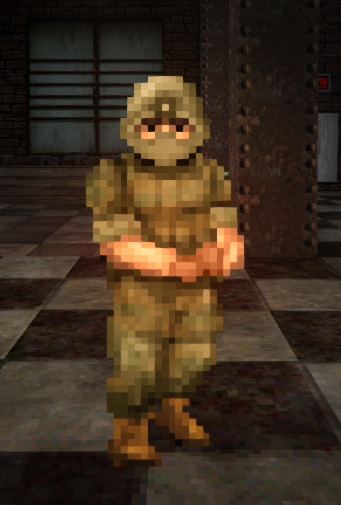
</p>

* `ru_vsr`
* `ru_emr`

<p>
	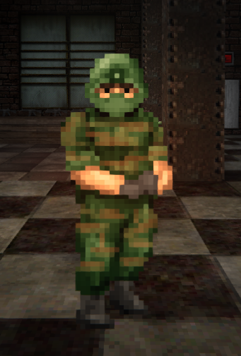
	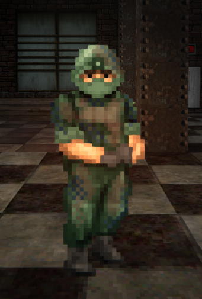
</p>

## Game Options

Options for this mod can be found in at the bottom of the default GZdoom options menu.

### Replace Mode

- None: Weapons from this mod will not spawn in levels. Gear can only be obtained via the loadout manager.
- Replace: Hideous Destructor weapon spawns will be replaced with weapons from this mod.
- Map: Weapons are only replaced at the start of the level.

WARNING: Vanilla loadouts and certain vanilla weapons will not function properly if using replace mode. This is intended to replace the default weapons entirely. It is still possible to spawn vanilla items via the loadout manager, but they will not function properly. If you want to use both weapons, play using map start or map mixed. The following items are replaced:

- Pistol with the Glock
- SMG with the MP5
- ZM66 with the M4
- Liberator with the M14
- Chaingun with the M249
- D.E.R.P. robot with the F.H. robot
- T.H.E.R.P. robot

Also note that other mods that spawn or replace actors if using "Replace" mode may continue to spawn even though they should be replaced. You'll be able to pick up these items and use them, but dropping them will trigger a replacement. 

### AI Replace Mode

There are 4 enemies available at the moment that can replace vanilla HD monsters.

- None: Enemies will not spawn. 
- Replace: Enemies will be replaced, including enemies spawning it.
- Map: Enemies are only replaced at the start of the level. 

You can adjust the chances of each enemy spawning. The enemies are:

- Scout: MP5
- Rifleman: M4
- Ranger: M14
- Shotgunner: Fauxtech Origin 12

### Sight Mode

- Full: The entire back of the sight is shown. Uses the most screen space.
- Minimal: Only the parts vital to being able to aim are shown.

### Attachment Spawn Mode

- None: Weapons when they spawn will not have any attachments other than default sights.
- Random: Weapons will spawn with random attachments. 

### Backpack Mode

- Vanilla: Wild backpacks are vanilla style random contents
- Alternative: Wild backpack contents are randomized differently

## Experimental Options

### Resource Mode

- Off: Resources & crafting workbenches will not spawn
- On: Resources will spawn randomly around the map. 2 crafting benches will appear per map.

### Weapon Mag Mode

- Off: Weapons will spawn, including ones dropped from enemies, without magazines and/or a chambered round. (Not completed).
- On: (Default) Weapons will spawn with a full mag and chambered weapon.

### Loose Mag mode

- Off: Magazines will spawn empty. (Not completed)
- On: (Default) Magazines will spawn full.

## Weapons

### Glock

<p align="center">
	
	
</p>

### MP5 & MP5 M203

<p align="center">


</p>

<p align="center">


</p>

### M4 & M4 M203

<p align="center">


</p>

<p align="center">


</p>

### M14

<p align="center">


</p>
<p align="center">


</p>

### Fauxtech Origin 12

<p align="center">


</p>

### M249

<p align="center">


</p>

### M107

<p align="center">

</p>

### RPG

<p align="center">

</p>

### AKM

<p align="center">
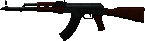
</p>

### AKS74u

<p align="center">
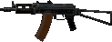
</p>

### Uzi

<p align="center">
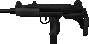
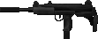
</p>

## Ammo

Each weapon has its own magazine/drum/pouch. The Glock and MP5 are chambered in the the default Hideous Destructor 9mm bullet. The Fauxtech Origin also reuses the default Hideous Destructor shotgun shells. Ammo for the M203 uses the default rocket grenade ammo as well. 

<p>
	
	
	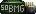
	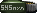
	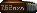
	
</p>

- Glock magazine (9mm): 15 rounds
- MP5 magazine (9mm): 30 rounds
- M4 magazine (5.56mm): 30 rounds
- M14 magazine (7.62mm): 20 rounds
- Fauxtech drum (12 gauge): 20 shells
- M249 pouch (5.56mm): 200 rounds
- M107 magazine (.50 cal) 10 rounds
- AKM magazine (7.62mm): 30 rounds
- AKS74u magazine (5.45mm): 30 rounds
- Uzi magazine (9mm): 30 rounds

For the M249 pouch, a reloading tool is available. It is similar to the 7mm reloader. It needs an empty M249 magazine and loose 5.56 rounds.

## Using Attachments

Attachments will either be found in backpacks or already equipped on weapons dropped by enemies. An attachment must be compatible with the weapon to be able to attach it. To swap an attachment, simply use an attachment item. It will remove the attachment already occupying the slot, place it back in your inventory, and attach the item just used. 

There is a keybind available for removing each attachment in the options for opening an attachment manager.

## Loadout Manager

Weapons are configured based on the follow syntax: `w## ba# bs# bm#`. The values for input are shown below.

- `w##` is the weapon reference number
- `ba#` is the muzzle attachment reference number
- `bs#` is the sight attachment reference number
- `bm#` is the misc. attachment reference number

It's possible via the loadout manager to place attachments on weapons that otherwise wouldn't be supported. This is a known issue. You can remove the attachment, but you won't be able to put it back on later. Putting chokes on weapons other than the Fauxtech Origin will have no effect.

Magazines for weapons correspond to their weapon number, except for the M203 weapon variants. 

- `m01`: Glock magazine

<p></p>

- `m02`: MP5 magazine

<p></p>

- `m03`: M4 magazine

<p></p>

- `m04`: M14 magazine

<p></p>

- `m05`: Fauxtech Origin drum

<p></p>

- `m06`: M249 pouch

<p></p>

- `m10`: M107 magazine

<p></p>

- `m11`: AKS74u magazine

<p>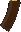</p>

- `m12`: AKM magazine

<p></p>

- `m13`: Uzi magazine

<p></p>

Note: The M4 and Fauxtech Origin by default have no rear sight. You have to pick one yourself or you will only see the front sight image.

### Weapon IDs

- `w01`: Glock
- `w02`: MP5
- `w03`: M4
- `w04`: M14
- `w05`: Fauxtech Origin
- `w06`: M249
- `w07`: M4 M203
- `w08`: MP5 M203
- `w09`: RPG
- `w10`: M107
- `w11`: AKS74u
- `w12`: AKM
- `w13`: Uzi

### Muzzle IDs

- `ba1`: 5.56mm suppressor
- `ba2`: 5.56mm flash suppressor
- `ba3`: 9mm suppressor
- `ba4`: 7.62mm suppressor
- `ba5`: Fauxtech Silencerr
- `ba6`: Fauxtech Improved Choke
- `ba7`: Fauxtech Modified Choke
- `ba8`: Fauxtech Full Choke

### Sight IDs

- `bs1`: M4 Rear ironsight

<p></p>

- `bs2`: M4 Carryhandle

<p></p>

- `bs3`: Fauxtech Origin Diamond Sight

<p></p>

- `bs4`: ACOG

<p></p>

- `bs5`: Red dot

<p></p>

- `bs6`: Holo sight

<p></p>

- `bs7`: Reflex sight

<p></p>

- `bs8`: 10x Scope

<p></p>

### Misc IDs

- `bm1`: Flashlight attachment

### Attachment Loadout IDs

These are for adding attachments as loose items in your inventory if you plan to switch between multiple sights.

- `m4i`: M4 default rear sight
- `m4c`: M4 carryhandle
- `dia`: Fauxtech diamond sight
- `acg`: ACOG
- `rdt`: Red-dot Sight
- `hrd`: Holo sight
- `rfr`: Reflex sight
- `s10`: 10x Sight

- `sl5`: 5.56 silencer
- `sl7`: 7.62 silencer
- `sl9`: 9mm silencer
- `slf`: Fauxtech Silencer
- `ck1`: Fauxtech improved choke
- `ck2`: Fauxtech modified choke
- `ck3`: Fauxtech full choke

- `gfl`: Misc flashlight attachment

### Misc Loadout IDs

- `r04`: M249 pouch reloader
- `fhr`: F.H. robot
- `thp`: Tactical H.E.R.P.

### Crafting IDs

- `bcr`: Ball crafter
- `ccr`: Case crafter
- `asm`: Bullet Assembler
- `rsm`: Rocket Assembler
